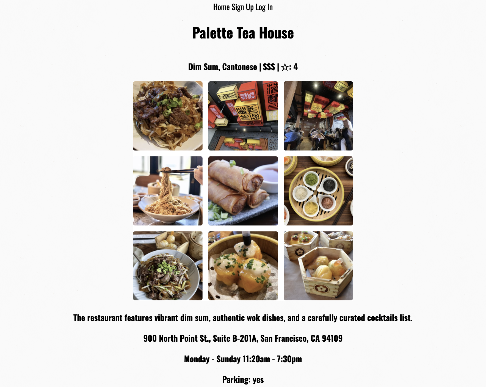
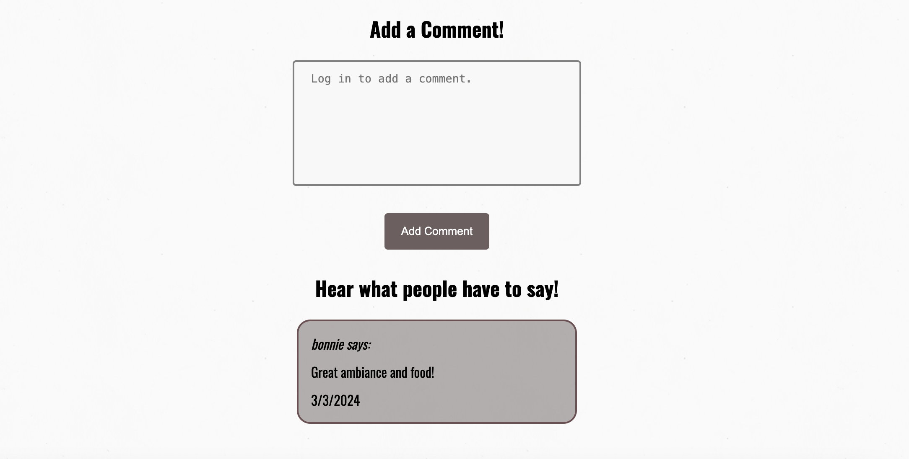

# Project-2---Restaurant-Story

My Restaurant Story

A blog for foodie lovers to share their favorite restaurants! Scroll through the site for restaurant recommendations and hear what people have to say. Create an account to add restaurants and interact with other users who share your love for food. 

Technologies Used:

HTML
CSS
JavaScript
MongoDB
Mongoose

Click to view My Restaurant Story:

https://github.com/bonnil1/Project-2---Restaurant-Story

https://trello.com/b/gmHQ7Xfz/project-2

Next Steps: 

~ Add style to the res.send pages when no user is found and when login information is incorrect.

~ Create an option for each logged in user to "like" or save a restaurant and have that restaurant saved to their account.

~ A larger vision - have each user account linked to their own 'my restaurant story'. Account users can comment on another user's 'my restaurant story' but cannot make changes. 